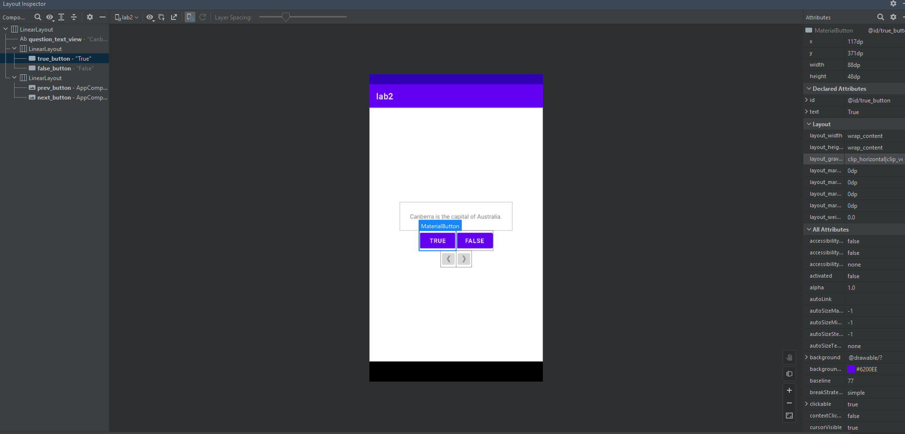
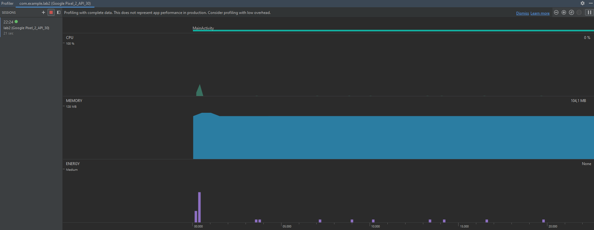
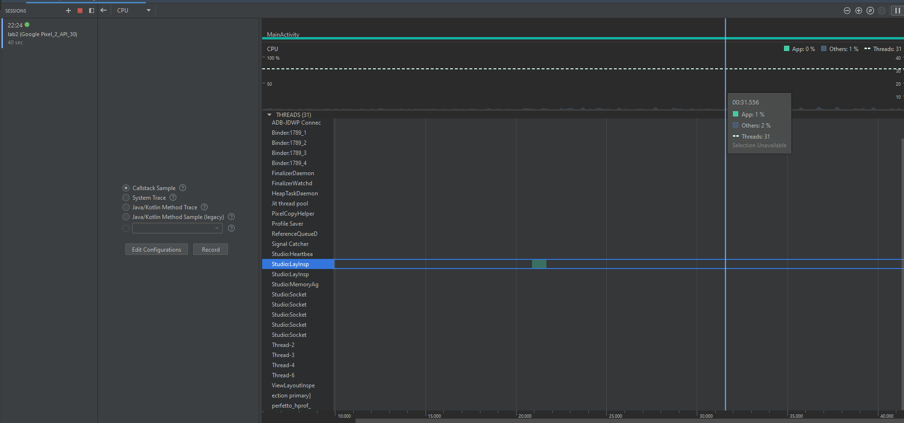

<h2 align="center">  МИНИСТЕРСТВО НАУКИ И ВЫСШЕГО ОБРАЗОВАНИЯ РОССИЙСКОЙ ФЕДЕРАЦИИ ФЕДЕРАЛЬНОЕ ГОСУДАРСТВЕННОЕ БЮДЖЕТНОЕ ОБРАЗОВАТЕЛЬНОЕ УЧРЕЖДЕНИЕ ВЫСШЕГО ОБРАЗОВАНИЯ «САХАЛИНСКИЙ ГОСУДАРСТВЕННЫЙ УНИВЕРСИТЕТ» </h2>

<h3>Институт естественных наук и техносферной безопасности
 
Кафедра информатики
 
Половников Владислав Олегович</h3>

 
<h3>Лабораторная работа №4
 
“Отладка Android-приложений”
 
01.03.02 Прикладная математика и информатика</h3>
 
 
 
 
 
 
 
 
 
 
 
 
 
 
<h3 align="right">Научный руководитель
 
Соболев Евгений Игоревич
</h3>

<h3 align="center">Южно-Сахалинск
 
2022г.
</h3>

Kotlin - это высокоэффективный современный язык программирования, разработанный компанией JetBrains. Он имеет очень чёткий и лаконичный синтаксис, что делает ваш код лёгким для чтения. Kotlin широко используется во всём мире, и его популярность среди разработчиков постоянно растёт. Многие разработчики, использующие Kotlin, отмечают, что это делает их работу быстрее и увлекательнее.

<h3 align="center">Задание</h3>

Упражнение. Исследуем Layout Inspector
Для диагностики проблем с файлами макетов и интерактивного анализа визуализации макета на экране можно воспользоваться инструментом Layout Inspector. Убедитесь в том, что GeoQuiz выполняется в эмуляторе, и нажмите кнопку Layout Inspector на левой панели окна Android Monitor. Далее вы сможете исследовать свойства своего макета, щелкая на элементах в представлении Layout Inspector. 

Упражнение. Profiler 
С помощью инструмента Profiler создаются подробные отчеты о том, как ваше приложение использует ресурсы Android-устройства, а именно процессор и память. Это полезно при оценке и настройке производительности вашего приложения. Для просмотра окна Profiler запустите приложение на подключенном Android устройстве или эмуляторе, в строке меню выберите команду View ⇒ Tool Windows ⇒ Profiler. В открывшемся окне Profiler отобразится временная шкала с показаниями по использованию сети, процессора, памяти и заряда аккумулятора. Щелкните по разделу, чтобы увидеть более подробную информацию об использовании этого ресурса вашим приложением. В режиме просмотра процессора нажмите кнопку Record, чтобы получить более подробную информацию об использовании процессора. После выполнения любых взаимодействий с приложением, которые вы хотите записать, нажмите кнопку Stop, чтобы остановить запись.

<h2 align="center">Решение</h2>

<h4>Вывод: Я научился отлаживать проекты</h4>

